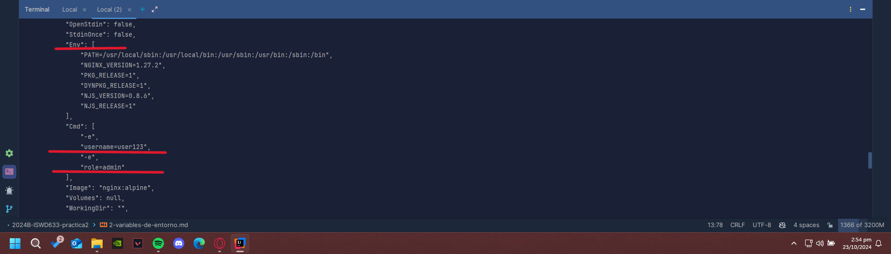
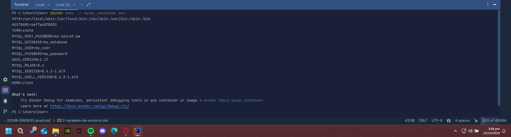

# Variables de Entorno
### ¿Qué son las variables de entorno?
Las variables de entorno son pares de clave-valor que permiten pasar configuraciones y parámetros a contenedores. Se pueden establecer al momento de crear un contenedor y pueden ser accedidas dentro de la aplicación en ejecución.

### Para crear un contenedor con variables de entorno?

```
docker run -d --name <nombre contenedor> -e <nombre variable1>=<valor1> -e <nombre variable2>=<valor2>
```

### Crear un contenedor a partir de la imagen de nginx:alpine con las siguientes variables de entorno: username y role. Para la variable de entorno rol asignar el valor admin.

````docker run -d --name nginx nginx:alpine -e username=user123 -e role=admin````


### Crear un contenedor con mysql:8, mapear todos los puertos
````docker run -P -d --name mysql_container mysql:8 ````

### ¿El contenedor se está ejecutando?
No se está ejecutando

### Identificar el problema
Para contenedores creados a partir de MYSQL, es necesario crear variables de entorno, específicamente, la de MYSQL_ROOT_PASSWORD, ya que de esta manera se puede establecer la contraseña del usuario root. Sin esta contraseña el servidor MySQL no se puede iniciar.

### Eliminar el contenedor creado con mysql:8 
````docker rm mysql_container````

### Para crear un contenedor con variables de entorno especificadas
- Portabilidad: Las aplicaciones se vuelven más portátiles y pueden ser desplegadas en diferentes entornos (desarrollo, pruebas, producción) simplemente cambiando el archivo de variables de entorno.
- Centralización: Todas las configuraciones importantes se centralizan en un solo lugar, lo que facilita la gestión y auditoría de las configuraciones.
- Consistencia: Asegura que todos los miembros del equipo de desarrollo o los entornos de despliegue utilicen las mismas configuraciones.
- Evitar Exposición en el Código: Mantener variables sensibles como contraseñas, claves API, y tokens fuera del código fuente reduce el riesgo de exposición accidental a través del control de versiones.
- Control de Acceso: Los archivos de variables de entorno pueden ser gestionados con permisos específicos, limitando quién puede ver o modificar la configuración sensible.

Previo a esto es necesario crear el archivo y colocar las variables en un archivo, **.env** se ha convertido en una convención estándar, pero también es posible usar cualquier extensión como **.txt**.
```
docker run -d --name <nombre contenedor> --env-file=<nombreArchivo>.<extensión> <nombre imagen>
```
**Considerar**
Es necesario especificar la ruta absoluta del archivo si este se encuentra en una ubicación diferente a la que estás ejecutando el comando docker run.

### Crear un contenedor con mysql:8, mapear todos los puertos y configurar las variables de entorno mediante un archivo
````docker run -d --name mysql_container --env-file=C:\Users\User\variables\mysql_env.env mysql:8````  


### ¿Qué bases de datos existen en el contenedor creado?
Comandos:

````docker exec -it mysql_container mysql -u root -p````

````SHOW DATABASES;````

Bases de datos:  
- information_schema
- my_database
- mysql
- performance_schema
- sys