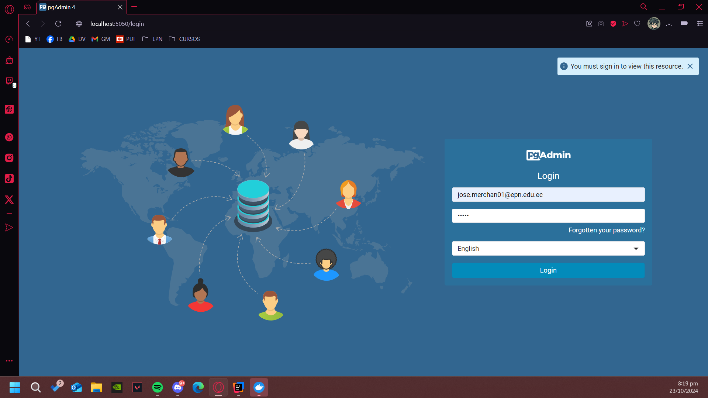
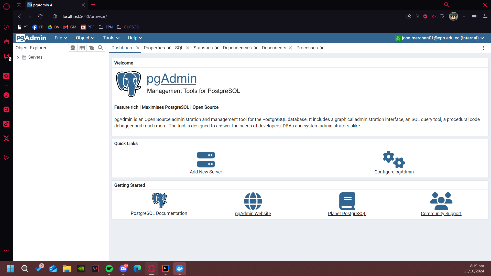
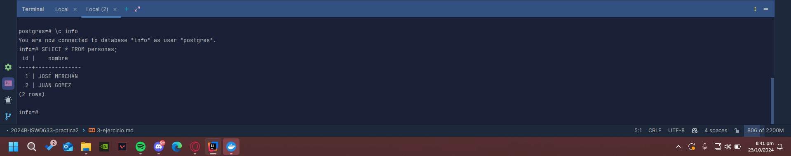

### Crear contenedor de Postgres sin que exponga los puertos. Usar la imagen: postgres:11.21-alpine3.17
Primero se debe crear una red para conectar los 2 contenedores:

````docker rm -f postgres_container pgadmin_container````   

Luego se crea el contenedor postgres

````docker run -d --name postgres_container --network pg_network -e POSTGRES_PASSWORD=admin postgres:11.21-alpine3.17````

### Crear un cliente de postgres. Usar la imagen: dpage/pgadmin4

````docker run -d --name pgadmin_container --network pg_network -e PGADMIN_DEFAULT_EMAIL=jose.merchan01@epn.edu.ec -e PGADMIN_DEFAULT_PASSWORD=admin -p 5050:80 dpage/pgadmin4````

La figura presenta el esquema creado en donde los puertos son:
- a: 5050
- b: 80
- c: 5432


## Desde el cliente
### Acceder desde el cliente al servidor postgres creado.


### Crear la base de datos info, y dentro de esa base la tabla personas, con id (serial) y nombre (varchar), agregar un par de registros en la tabla, obligatorio incluir su nombre.

## Desde el servidor postgresl
### Acceder al servidor
### Conectarse a la base de datos info
````docker exec -it postgres_container psql -U postgres````  

````\c info````
### Realizar un select *from personas
