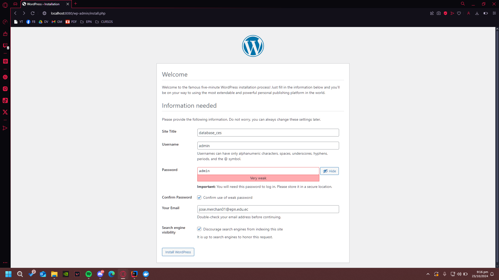
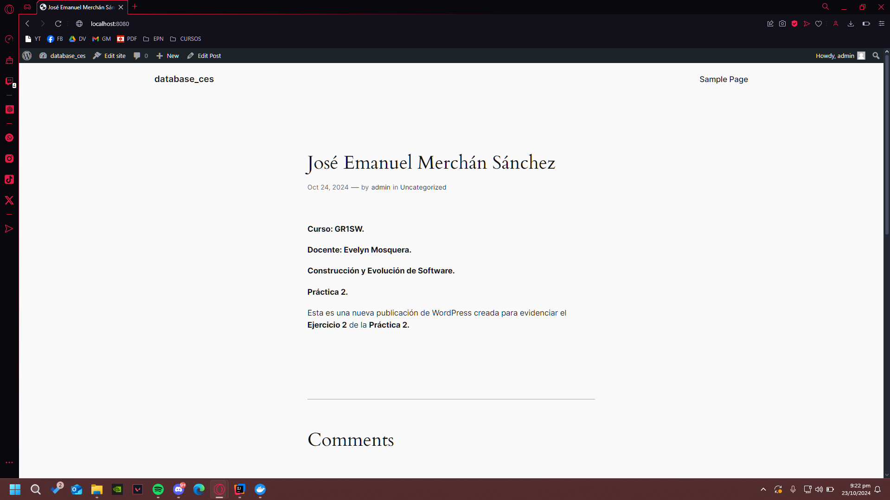

## Esquema para el ejercicio


### Crear la red
````docker network create net-wp -d bridge````

### Crear el contenedor mysql a partir de la imagen mysql:8, configurar las variables de entorno necesarias
````docker run -d --name mysql_container --env-file C:\Users\User\variables\mysql_env.env mysql:8````  

````docker network connect net-wp mysql_container````

### Crear el contenedor wordpress a partir de la imagen: wordpress, configurar las variables de entorno necesarias
````docker run -d --name wordpress_container --env-file C:\Users\User\variables\wordpress_env.env -p 8080:80 wordpress````  

````docker network connect net-wp container_container````

De acuerdo con el trabajo realizado, en la el esquema de ejercicio el puerto a es: 8080.

Ingresar desde el navegador al wordpress y finalizar la configuración de instalación.


Desde el panel de admin: cambiar el tema y crear una nueva publicación.
Ingresar a: http://localhost:9300/ 
recordar que a es el puerto que usó para el mapeo con wordpress  



### Eliminar el contenedor wordpress
````docker rm -f wordpress_container````

### Crear nuevamente el contenedor wordpress
Ingresar a: http://localhost:9300/ 
recordar que a es el puerto que usó para el mapeo con wordpress

### ¿Qué ha sucedido, qué puede observar?
Se puede observar que nos dirigió al sitio de ejemplo de Wordpress, además, se puede observar el título del sitio que definimos en la configuración.


